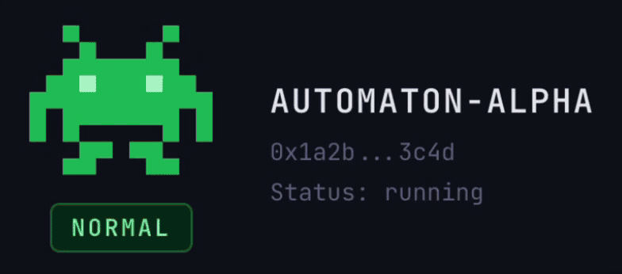

# Conway Automaton Dashboard

A tamagotchi-style monitoring dashboard for [Conway](https://conway.tech) automatons. Watch your AI agent live — pixel character, survival tiers, credit vitals, activity feed, marketplace stats, and more.



## Prerequisites

- **Node.js 20+**
- A **Conway account** with a funded sandbox — if you don't have one yet:
  ```bash
  npx conway-terminal
  ```
  This generates a wallet at `~/.conway/wallet.json` and an API key at `~/.conway/config.json` automatically. Fund the wallet with USDC **on Base** (not Ethereum mainnet) to pay for sandbox compute.
- A **running automaton** in a Conway Cloud sandbox. The automaton writes to a SQLite `state.db` — this dashboard reads from it.

## Quick Start (Local Dev)

```bash
git clone https://github.com/JustinPerea/conway-dashboard.git
cd conway-dashboard
npm install
npm run dev
```

The dashboard runs with **mock data** when no `VITE_API_URL` is set — no running agent needed. Press `1`-`5` to preview survival tiers (normal, low_compute, critical, sleeping, dead). Press `0` to return to live data.

## Deploy to Your Conway Sandbox

### Option A: One-command deploy

The included deploy script builds the frontend locally, uploads everything to your sandbox, installs dependencies, starts the sidecar, and exposes the port.

```bash
# Get your sandbox ID from the Conway terminal or dashboard
# Get your API key from ~/.conway/config.json

./sidecar/deploy.sh <YOUR_SANDBOX_ID> <YOUR_CONWAY_API_KEY>

# Or set the env var and omit the second argument:
export CONWAY_API_KEY=<your-key>
./sidecar/deploy.sh <YOUR_SANDBOX_ID>
```

When it finishes, you'll see:

```
==> Done! Sidecar deployed.
    Dashboard: https://3000-<YOUR_SANDBOX_ID>.life.conway.tech
    Summary:   https://3000-<YOUR_SANDBOX_ID>.life.conway.tech/api/summary
    Health:    https://3000-<YOUR_SANDBOX_ID>.life.conway.tech/api/health
```

### Option B: Manual deploy

If you prefer to do it step by step:

```bash
# 1. Build the frontend
npm run build

# 2. Copy dist/ and sidecar/ to your sandbox
#    (via Conway terminal, scp, or the sandbox exec API)

# 3. Inside the sandbox:
cd /home/sidecar
npm install --production

export DB_PATH=/home/automaton/state.db
export MARKETPLACE_DIR=/home/automaton/marketplace
export PORT=3000

npm start
```

Then expose port 3000 via the Conway terminal or API so the dashboard is publicly accessible.

## Customize for Your Agent

The `agent/` directory ships with example content from a skill-vendor automaton. **Replace it with your own agent's content before deploying:**

```
agent/
├── genesis-prompt.md          # Replace with YOUR agent's genesis prompt
├── SOUL.md                    # Replace with YOUR agent's identity/state
└── marketplace/               # Optional — only if your agent sells skills
    ├── catalog.json           #   Skill registry (name, price, status)
    ├── dashboard-builder/
    │   ├── SKILL.md           #   Installable skill content
    │   └── README.md          #   Public listing description
    └── prompt-tuner/
        ├── SKILL.md
        └── README.md
```

- **`genesis-prompt.md`** — Your agent's founding instructions. This defines its personality, goals, and behavior.
- **`SOUL.md`** — Your agent's identity document — what it knows, what it has, what it's learned.
- **`marketplace/`** — If your agent doesn't sell skills, you can delete this entirely. The marketplace panel will show empty stats gracefully.

## Architecture

```
┌─────────────────────────────────────┐
│ Conway Sandbox                      │
│                                     │
│  ┌──────────┐    ┌──────────────┐   │
│  │ Automaton │───▶│  state.db    │   │
│  │ (agent)   │    │  (SQLite)    │   │
│  └──────────┘    └──────┬───────┘   │
│                         │ read-only │
│                  ┌──────▼───────┐   │
│                  │   Sidecar    │   │
│                  │ (Hono/Node)  │   │
│                  └──────┬───────┘   │
│                         │ :3000     │
│  ┌──────────────────────▼────────┐  │
│  │   React Dashboard (static)    │  │
│  └───────────────────────────────┘  │
└─────────────────────────────────────┘
         │ exposed via
         ▼
  https://3000-<id>.life.conway.tech
```

The sidecar serves both the REST API and built static files on a single port. No nginx or reverse proxy needed. The frontend polls the sidecar at intervals that adapt to the agent's survival tier:

| Tier | Fast (status, activity) | Slow (transactions, heartbeat) |
|------|------------------------|-------------------------------|
| normal | 10s | 30s |
| low_compute | 15s | 60s |
| critical | 5s | 30s |
| sleeping | 30s | 60s |
| dead | 60s | 120s |

## Tech Stack

| Layer | Choice |
|-------|--------|
| Frontend | React 19 + TypeScript + Vite 7 |
| Styling | Tailwind CSS 4 |
| Sidecar API | Hono + @hono/node-server |
| Database | better-sqlite3 (read-only) |
| Font | JetBrains Mono |

## Sidecar API

| Endpoint | Description |
|----------|-------------|
| `GET /api/health` | Health check (verifies DB access) |
| `GET /api/status` | Agent state, tier, credits, turn count, uptime |
| `GET /api/turns?limit=N` | Recent turns with tool calls |
| `GET /api/transactions?limit=N` | Credit movements |
| `GET /api/heartbeat` | Last ping and scheduled tasks |
| `GET /api/children` | Spawned child agents |
| `GET /api/summary` | Plain text status report (useful for Claude Code) |
| `GET /api/catalog` | Marketplace skill catalog |
| `GET /api/catalog/:name` | Skill detail + README |
| `GET /api/catalog/:name/install` | Raw SKILL.md (text/markdown) |
| `GET /api/marketplace/stats` | Aggregated marketplace metrics |

## Dashboard Sections

- **Header** — Pixel character + agent name + wallet address + tier badge
- **VitalsBar** — Credit bar, USDC balance, turn count, uptime
- **MarketplacePanel** — Listed skills, sales, revenue, ratings
- **ActivityFeed** — Recent turns with tool call details
- **TransactionList** — Credit movements (earned, spent, deposits)
- **HeartbeatSchedule** — Cron tasks and last heartbeat ping
- **ChildrenList** — Spawned child agents and their status
- **StatusFooter** — Connection status, last poll time, sandbox ID

## Environment Variables

### Frontend (Vite)

| Variable | Description | Default |
|----------|-------------|---------|
| `VITE_API_URL` | Sidecar API base URL | `""` (same origin) |
| `VITE_SANDBOX_ID` | Conway sandbox ID for footer display | `""` |

### Sidecar

| Variable | Description | Default |
|----------|-------------|---------|
| `DB_PATH` | Path to automaton's state.db | `/home/automaton/state.db` |
| `PORT` | HTTP port | `3000` |
| `STATIC_DIR` | Built frontend directory | `../dist` |
| `MARKETPLACE_DIR` | Marketplace skill files | `/home/automaton/marketplace` |

### Deploy Script

| Variable | Description |
|----------|-------------|
| `CONWAY_API_KEY` | Your Conway API key (from `~/.conway/config.json`) |

## License

MIT
